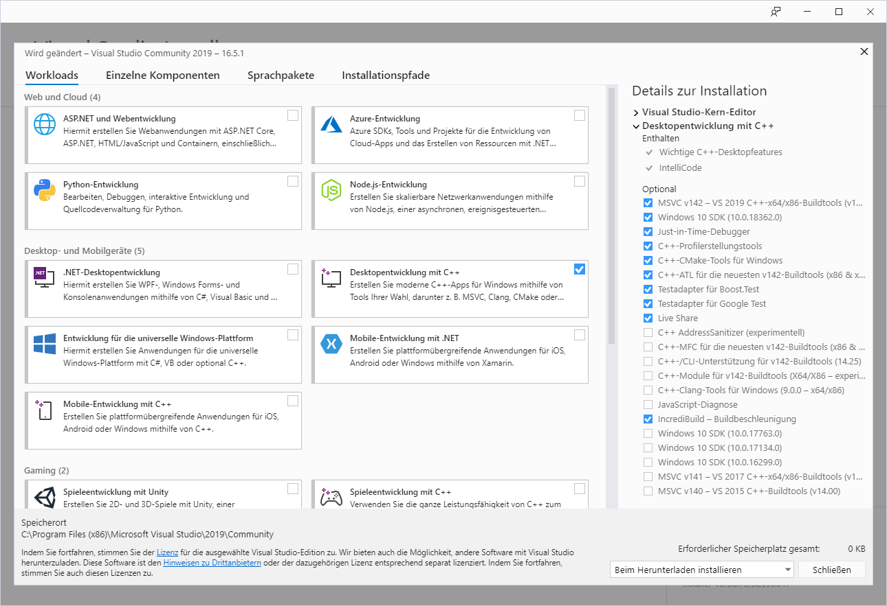
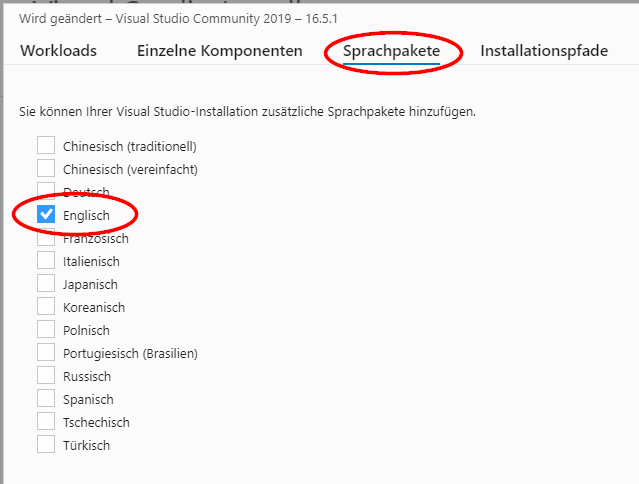
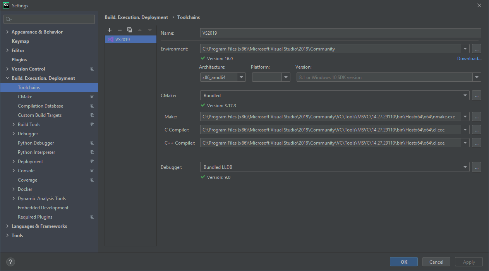
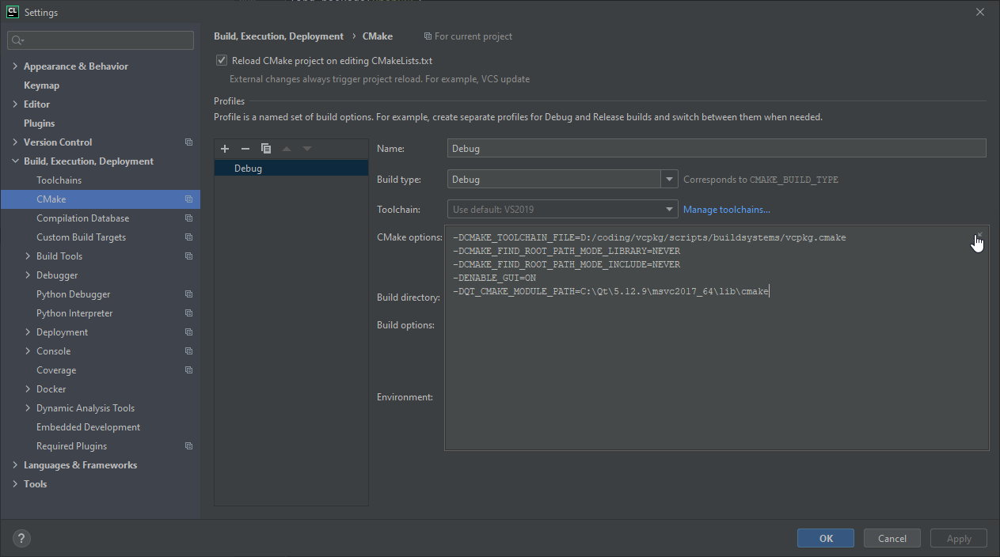
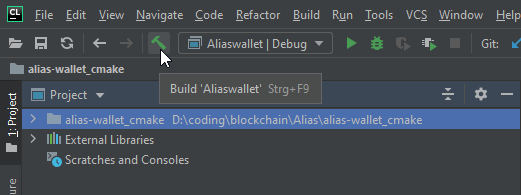

# Spectrecoin building from source on Windows

The goal is to build the whole project using CMake. To do so, just
follow the steps below.

* [Install required tools and libs](#tools)
  * [Git](#git)
  * [Visual Studio](#vs)
  * [Qt](#qt)
  * [VCPKG](#vcpkg)
* [Build Alias Wallet](#build)
  * via [cmdline](#build-cmdline)
  * on [CLion](#build-clion)


## <a name="tools"></a>Install required tools and libs


### <a name="git"></a>Git

* Download from https://git-scm.com/
* Just install it with default settings. ;-)


### <a name="vs"></a>Visual Studio 2019
* Download from [https://www.visualstudio.com/downloads/](https://www.visualstudio.com/downloads/)
* Visual Studio 2019 Community Edition is enough.
* Install at least these components:  
  
* **Important:** If you're not on an English Windows, you need to install the Englisch language package too:  
  


### <a name="qt"></a>Qt
Qt SDK can be found at [https://www.qt.io/download-qt-installer](https://www.qt.io/download-qt-installer).
Here are the components from Qt SDK that we really need to compile Spectrecoin
application. Please keep Qt creator selected as well! If MinGW is ticked you
may untick that, unless you need it for other projects.

Select the components from the latest 5.12 release as this is an LTS line.
With newer versions up to 5.15.1 (at the time of this writing), the build
will work but we've spot issues with a duplicated task bar icon. So it's
perfectly fine to stay on the latest 5.12 version.


### <a name="vcpkg"></a>VCPKG
VCPKG is a Github project, you can find it at [https://github.com/microsoft/vcpkg/](https://github.com/microsoft/vcpkg/)

At first change to your desired directory and clone VCPKG Git repository:

```
D:\coding> git clone https://github.com/Microsoft/vcpkg.git
```

Before building the required vcpkg components, you need to define the following
environment variable, to enable build in 64Bit:

`VCPKG_DEFAULT_TRIPLET=x64-windows`

Now enable deprecated functions on OpenSSL. To do so, modify `ports/openssl-windows/portfile.cmake`
by replacing the block

```
set(CONFIGURE_COMMAND ${PERL} Configure
    enable-static-engine
    enable-capieng
    no-ssl2
    -utf-8
    ${OPENSSL_SHARED}
)
```

with this one:

```
set(CONFIGURE_COMMAND ${PERL} Configure
    enable-deprecated                         <-- Add this entry
    enable-static-engine
    enable-capieng
    no-ssl2
    -utf-8
    ${OPENSSL_SHARED}
)
```

Should be around line 38.

**Important:** For all the next steps on vcpkg, you need to use `Start menu` >
`Visual Studio 2019` > `x64 Native Tools Command Prompt for VS 2019` for all the next steps!

On `x64 Native Tools Command Prompt for VS 2019` bootstrap the whole thing:

```
D:\coding> cd vcpkg
D:\coding\vcpkg> .\bootstrap-vcpkg.bat
```

After this, make vcpkg global available by executing the following cmd **once 
as Administrator**:

```
D:\coding\vcpkg> .\vcpkg.exe integrate install
```

Subsequent executions could be done with normal user permissions.

Now install the following packages:

```
D:\coding\vcpkg> .\vcpkg.exe install berkeleydb boost leveldb openssl
```

In case you hit this build error on boost-math:
```
Building package boost-math[core]:x64-windows...
-- Downloading https://github.com/boostorg/math/archive/boost-1.72.0.tar.gz...
-- Extracting source D:/coding/vcpkg/downloads/boostorg-math-boost-1.72.0.tar.gz
CMake Error at scripts/cmake/vcpkg_extract_source_archive_ex.cmake:140 (file):
  file RENAME failed to rename

    D:/coding/vcpkg/buildtrees/boost-math/src/TEMP/math-boost-1.72.0

  to

    D:/coding/vcpkg/buildtrees/boost-math/src/ost-1.72.0-2786b6df16

  because: No such file or directory

Call Stack (most recent call first):
  scripts/cmake/vcpkg_from_github.cmake:139 (vcpkg_extract_source_archive_ex)
  ports/boost-math/portfile.cmake:5 (vcpkg_from_github)
  scripts/ports.cmake:76 (include)


Error: Building package boost-math:x64-windows failed with: BUILD_FAILED
Please ensure you're using the latest portfiles with `.\vcpkg update`, then
submit an issue at https://github.com/Microsoft/vcpkg/issues including:
  Package: boost-math:x64-windows
  Vcpkg version: 2020.02.04-nohash

Additionally, attach any relevant sections from the log files above.
```

Copy the folder D:\coding\vcpkg\buildtrees\boost-math\src\TEMP\math-boost-1.72.0 one folder
level up, rename it to ost-1.72.0-2786b6df16 and restart the build.


## <a name="build"></a>Build Alias Wallet
### Get sources
At first clone the Alias wallet repository:
```
D:\coding> git clone https://github.com/aliascash/alias-wallet 
```


### <a name="build-cmdline"></a>Build on cmdline
#### Setup environment
You need to define the following environment variables:
* `QTDIR` Pointing to the msvc directory within the Qt version to use
* `VSDIR` Pointing to the Visual Studio installation directory
* `VCPKGDIR` Pointing to the root directory of your vcpkg clone
* `CMAKEDIR` Pointing to the `bin` folder on the CMake installation to use.
  The cmake binaries from vcpkg are perfectly fine, see example below.

Example:
```
QTDIR=C:\Qt\5.12.9\msvc2017_64
VSDIR=C:\Program Files (x86)\Microsoft Visual Studio\2019
VCPKGDIR=D:\coding\vcpkg
CMAKEDIR=D:\coding\vcpkg\downloads\tools\cmake-3.17.2-windows\cmake-3.17.2-win32-x86\bin
```

#### Build
To build, just open a cmd window, cd into the Git clone of alias-wallet repository and
start the Windows build script:
```
D:\coding> scripts\cmake-build-win.bat
```
The build result could be found on the folder `build/Alias` inside of the Git clone.

### <a name="build-clion">Build with CLion
Go to `File` > `Settings` > `Build, Execution, Deployment` > `Toolchains` and make sure
the toolchain is configured as on the following screenshot:



Take special care of the path to the x86_64 version of Make, C and C++ compiler!

Now open `File` > `Settings` > `Build, Execution, Deployment` > `CMake`, expand
`CMake options` and put in the following content:

```
-DCMAKE_TOOLCHAIN_FILE=D:/coding/vcpkg/scripts/buildsystems/vcpkg.cmake
-DCMAKE_FIND_ROOT_PATH_MODE_LIBRARY=NEVER
-DCMAKE_FIND_ROOT_PATH_MODE_INCLUDE=NEVER
-DENABLE_GUI=ON
-DQT_CMAKE_MODULE_PATH=C:\Qt\5.12.9\msvc2017_64\lib\cmake
```



With a click on the "Build-Hammer", you can trigger the build:



## Library Notes

During the build the archive https://github.com/aliascash/resources/raw/master/resources/Tor.libraries.Win64.zip
will be downloaded and extracted. It contains the Tor binary and it's libraries. The archive is installed beside
the Alias binary and required on runtime.
