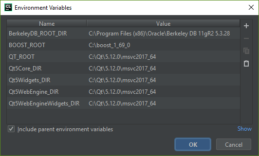

# Spectrecoin building from source with CMake on Windows

# Work in progress!!!

## Install required tools and libs

- Visual studio: https://www.visualstudio.com/downloads/
- Qt SDK: https://www.qt.io/download-qt-installer
- BerkeleyDB 5.3.28 http://download.oracle.com/otn/berkeley-db/db-5.3.28.msi
- Boost ...

Here are the components from Qt SDK that we really need to compile Spectrecoin
application. Please keep Qt creator selected as well! If MinGW is ticked you
may untick that, unless you need it for other projects.

Once you install Visual Studio. Go to Windows start menu and find "Visual Studio Installer"

Modify Visual Studio and make sure all those components are picked:

## Setup environment vars

Please use the default installation path `C:\Program Files (x86)\Microsoft Visual Studio`.

# OLD stuff:

## Easy (Prebuilt libs)

Since quite many of our users found it hard to compile, especially on
Windows, we are adding an easy way and provided prebuilt package for all
the libraries required to compile Spectrecoin wallet. Go ahead and download
all the libraries from the following links:

https://github.com/spectrecoin/resources/raw/master/resources/Spectrecoin.Prebuild.libraries.win64.zip
https://github.com/spectrecoin/resources/raw/master/resources/Spectrecoin.QT.libraries.win64.zip
https://github.com/spectrecoin/resources/raw/master/resources/Spectrecoin.Tor.libraries.win64.zip

Clone Spectrecoin repository. You can simply download the “Zip”s from Github.

Now unzip Prebuild, QT and Tor libraries.zip that you just downloaded into the
root folder of the cloned repository. Once done properly you should end up with
`src` and `packages64bit` all on one folder.

Now go ahead and open a the file src/src.pro (It should open up with Qt Creator).
Make sure MSVC 64 bit compiler is selected. Click configure and build and run as
usual with Qt.

## Library Notes

- The Tor libraries zip contains simply the official Tor binaries and are
  only required at runtime.
- The libraries contained in Spectrecoin.QT.libraries.win64.zip have been
  automatically gathered by QT with the windeployqt tool.
  See http://doc.qt.io/qt-5/windows-deployment.html

## Library Notes

You can use the scripts `scripts/win-genbuild.bat` and `scripts/win-build.bat`
to build from cmdline. The first script creates the header file `build.h` with
some required variable definitions. The second script performs the build itself
and to use it, you need to define `%QTDIR%`. This env var must point to the root
folder or your local Qt installation.

At the moment it is assumed, that MSVC is installed on the default path
`C:\Program Files (x86)\Microsoft Visual Studio`.
