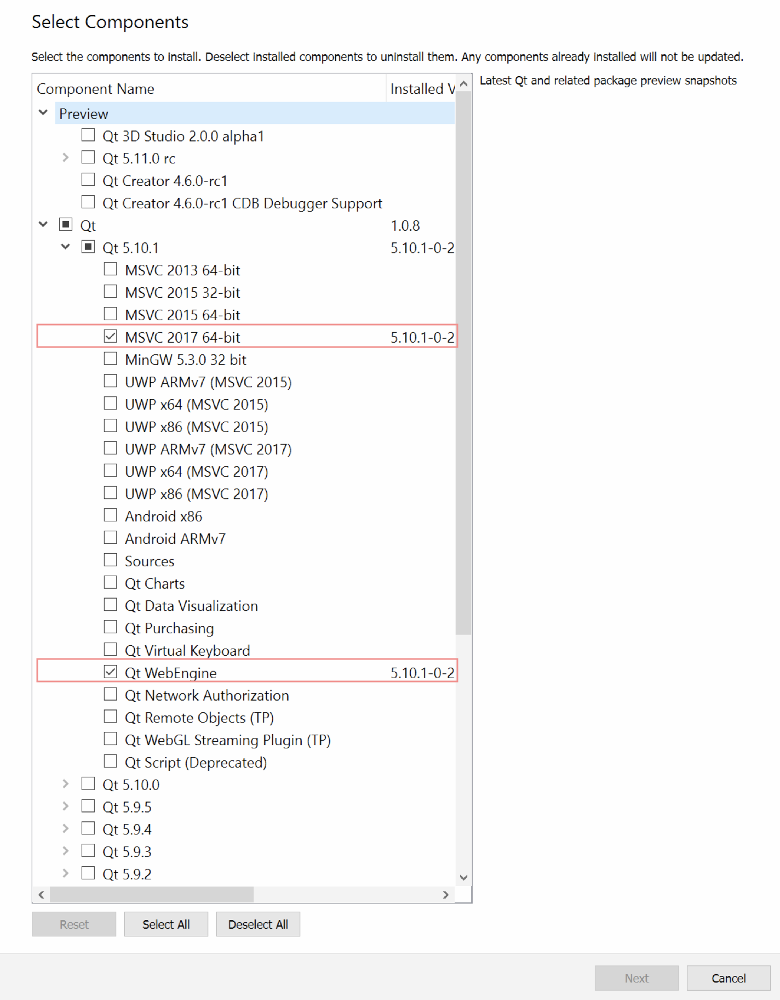

SpectreCoin Building from source for Windows (XSPEC)
====================================================

Dependencies
------------
•   Install MSVC 2017 and Qt SDK (Pick MSVC 64 bit and QtWebEngine)
o   Visual studio: https://www.visualstudio.com/downloads/
o   Qt SDK: https://www.qt.io/download-qt-installer
•   Here is the components from Qt SDK that we really need to compile our application (Keep Qt creator selected as well). If MingW is ticked you may untick that (Unless you need it for other projects)

